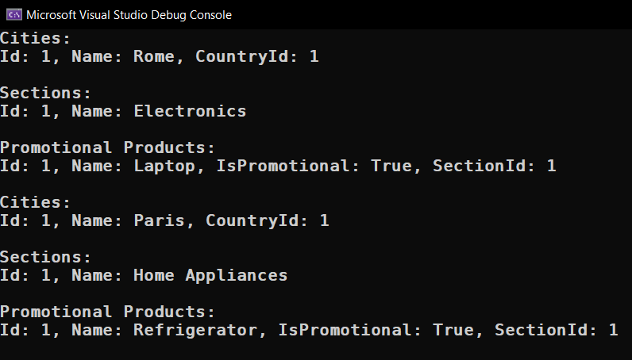

# Module 7.1

## Mailing List

- [Program.cs](MailingList/Program.cs)
- [Entities/](MailingList/Entities/)
  - [Customer.cs](MailingList/Entities/Customer.cs)
  - [Product.cs](MailingList/Entities/Product.cs)
  - [Section.cs](MailingList/Entities/Section.cs)
  - [City.cs](MailingList/Entities/City.cs)
  - [Country.cs](MailingList/Entities/Country.cs)

## Images

